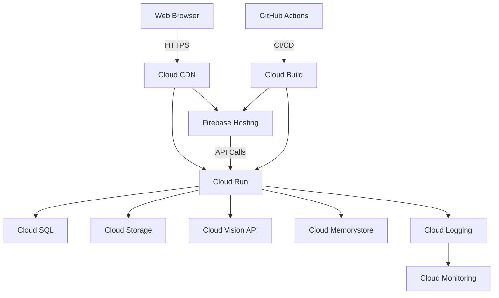
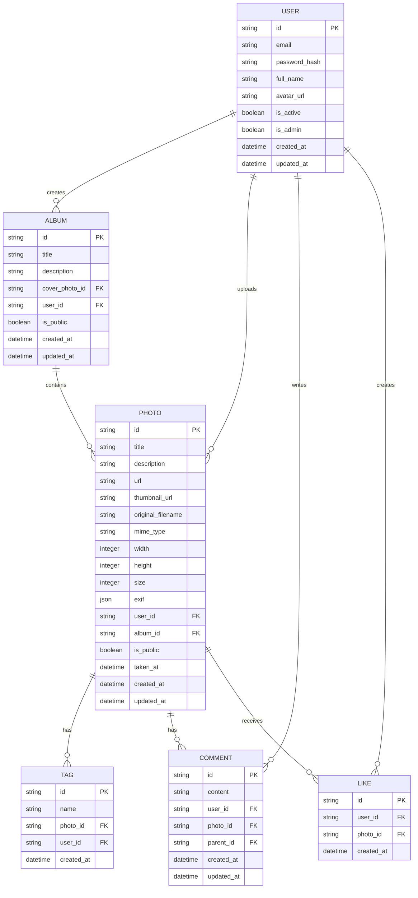
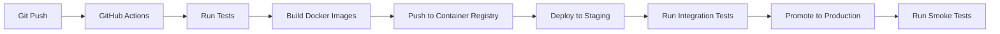

# Architecture Overview

This document provides a high-level overview of the Photo Portfolio application's architecture, including its components, data flow, and design decisions.

## Table of Contents

- [System Architecture](#system-architecture)
- [Backend Architecture](#backend-architecture)
- [Frontend Architecture](#frontend-architecture)
- [Data Model](#data-model)
- [API Design](#api-design)
- [Authentication & Authorization](#authentication--authorization)
- [Storage](#storage)
- [Caching](#caching)
- [Search](#search)
- [Deployment](#deployment)
- [Monitoring & Logging](#monitoring--logging)
- [Security](#security)
- [Scalability](#scalability)

## System Architecture



## Backend Architecture

The backend is built using Python and Flask, following a modular architecture:

```
backend/
├── app/                      # Main application package
│   ├── api/                  # API routes
│   │   ├── __init__.py
│   │   ├── auth.py           # Authentication endpoints
│   │   ├── photos.py         # Photo management endpoints
│   │   ├── albums.py         # Album management endpoints
│   │   ├── search.py         # Search endpoints
│   │   └── users.py          # User management endpoints
│   │
│   ├── models/             # Database models
│   │   ├── __init__.py
│   │   ├── user.py
│   │   ├── photo.py
│   │   ├── album.py
│   │   └── tag.py
│   │
│   ├── services/           # Business logic
│   │   ├── __init__.py
│   │   ├── auth_service.py
│   │   ├── photo_service.py
│   │   ├── storage_service.py
│   │   └── search_service.py
│   │
│   ├── utils/              # Utility functions
│   │   ├── __init__.py
│   │   ├── config.py
│   │   ├── exceptions.py
│   │   └── validators.py
│   │
│   ├── __init__.py         # Application factory
│   └── extensions.py       # Flask extensions
│
├── migrations/            # Database migrations
├── tests/                  # Test suite
├── .env.example           # Example environment variables
├── .gitignore
├── .dockerignore
├── Dockerfile             # Production Dockerfile
├── docker-compose.yml     # Local development
├── gunicorn.conf.py       # Gunicorn configuration
├── manage.py              # CLI commands
└── requirements.txt       # Dependencies
```

### Key Components

1. **API Layer**: Handles HTTP requests and responses, input validation, and authentication.
2. **Service Layer**: Contains business logic, data processing, and integration with external services.
3. **Data Access Layer**: Manages database operations using SQLAlchemy ORM.
4. **Storage Service**: Handles file uploads, downloads, and management in Google Cloud Storage.
5. **Search Service**: Provides search functionality using a combination of SQL queries and vector search.
6. **Authentication Service**: Manages user authentication and authorization using JWT.

## Frontend Architecture

The frontend is a single-page application (SPA) built with React and TypeScript:

```
frontend/
├── public/               # Static files
│   ├── index.html
│   └── assets/
│
├── src/
│   ├── components/       # Reusable UI components
│   │   ├── common/       # Common components (buttons, inputs, etc.)
│   │   ├── layout/       # Layout components (header, footer, etc.)
│   │   ├── photos/       # Photo-related components
│   │   ├── albums/       # Album-related components
│   │   └── auth/         # Authentication components
│   │
│   ├── pages/          # Page components
│   │   ├── Home/
│   │   ├── Login/
│   │   ├── Photos/
│   │   ├── Albums/
│   │   └── Settings/
│   │
│   ├── services/        # API service layer
│   │   ├── api.ts
│   │   ├── auth.ts
│   │   ├── photos.ts
│   │   └── albums.ts
│   │
│   ├── store/          # State management
│   │   ├── index.ts
│   │   ├── auth/
│   │   └── photos/
│   │
│   ├── types/           # TypeScript type definitions
│   ├── utils/           # Utility functions
│   ├── App.tsx
│   ├── index.tsx
│   └── routes.tsx
│
├── .env.example
├── package.json
├── tsconfig.json
└── README.md
```

## Data Model

### Entity Relationship Diagram



## API Design

The API follows RESTful principles with these conventions:

- **Base URL**: `/api/v1`
- **Authentication**: JWT Bearer Token
- **Response Format**: JSON
- **Error Handling**: Standard HTTP status codes with error details in the response body
- **Pagination**: `limit` and `offset` parameters for collection endpoints
- **Filtering**: Query parameters for filtering resources
- **Sorting**: `sort` parameter with field name and direction (e.g., `-created_at` for descending)
- **Field Selection**: `fields` parameter to limit returned fields
- **Versioning**: URL path versioning (`/api/v1/...`)

## Authentication & Authorization

### Authentication

- **JWT-based authentication**
- Access tokens with short expiration (15-60 minutes)
- Refresh tokens for obtaining new access tokens
- Secure cookie-based token storage
- CSRF protection

### Authorization

- **Role-Based Access Control (RBAC)** with the following roles:
  - `admin`: Full access to all resources
  - `user`: Regular user with permissions to manage own content
  - `guest`: Read-only access to public content

## Storage

### Google Cloud Storage

- **Original Images**: Stored in a private bucket with signed URLs for access
- **Derivatives**: Multiple sizes (thumbnail, medium, large) generated on upload
- **Metadata**: Stored in the database for fast querying
- **Lifecycle Policies**: Automatic deletion of temporary files
- **CORS**: Configured for web client access

### Database (Cloud SQL)

- **PostgreSQL** with PostGIS extension for geolocation queries
- **Connection Pooling**: Managed by SQLAlchemy
- **Read Replicas**: For read-heavy operations
- **Backups**: Automated daily backups with point-in-time recovery

## Caching

### Client-Side Caching

- **Browser Cache**: For static assets with long cache times
- **Service Worker**: For offline access and performance
- **Local Storage**: For user preferences and authentication state

### Server-Side Caching

- **Redis (Memorystore)**: For session storage and API response caching
- **CDN**: For static assets and image delivery
- **Database Query Caching**: For frequently accessed data

## Search

### Search Features

- **Full-Text Search**: For titles, descriptions, and tags
- **Semantic Search**: Using vector embeddings for visual similarity
- **Faceted Search**: Filter by tags, date ranges, and other metadata
- **Geospatial Search**: Find photos taken near a location

### Implementation

- **PostgreSQL Full-Text Search** for basic text search
- **pgvector** for vector similarity search
- **Elasticsearch** (optional) for advanced search features

## Deployment

### CI/CD Pipeline



### Infrastructure as Code

- **Terraform** for managing GCP resources
- **Kubernetes** for container orchestration (optional)
- **Helm** for Kubernetes package management

### Environment Configuration

- **Development**: Local Docker Compose environment
- **Staging**: Mirrors production with test data
- **Production**: Highly available and scalable on Google Cloud

## Monitoring & Logging

### Monitoring

- **Google Cloud Monitoring** for infrastructure metrics
- **Custom Metrics** for application-level metrics
- **Uptime Checks** for availability monitoring
- **Alerting** for critical issues

### Logging

- **Google Cloud Logging** for centralized log management
- **Structured Logging** for easy querying
- **Request Logging** with correlation IDs
- **Audit Logging** for security-relevant events

## Security

### Application Security

- **Input Validation**: Strict validation of all inputs
- **Output Encoding**: To prevent XSS attacks
- **Content Security Policy (CSP)**: To mitigate XSS risks
- **CORS**: Strict origin validation
- **Rate Limiting**: To prevent abuse

### Data Protection

- **Encryption at Rest**: For all stored data
- **Encryption in Transit**: TLS 1.2+ for all communications
- **Sensitive Data**: Never logged or exposed in responses
- **Data Retention**: Automatic cleanup of old data

## Scalability

### Horizontal Scaling

- **Stateless Architecture**: For easy scaling
- **Load Balancing**: With health checks
- **Auto-scaling**: Based on CPU, memory, and request metrics

### Performance Optimization

- **Database Indexing**: For common query patterns
- **Query Optimization**: With EXPLAIN ANALYZE
- **Connection Pooling**: To manage database connections
- **Caching**: At multiple levels
- **CDN**: For global content delivery
